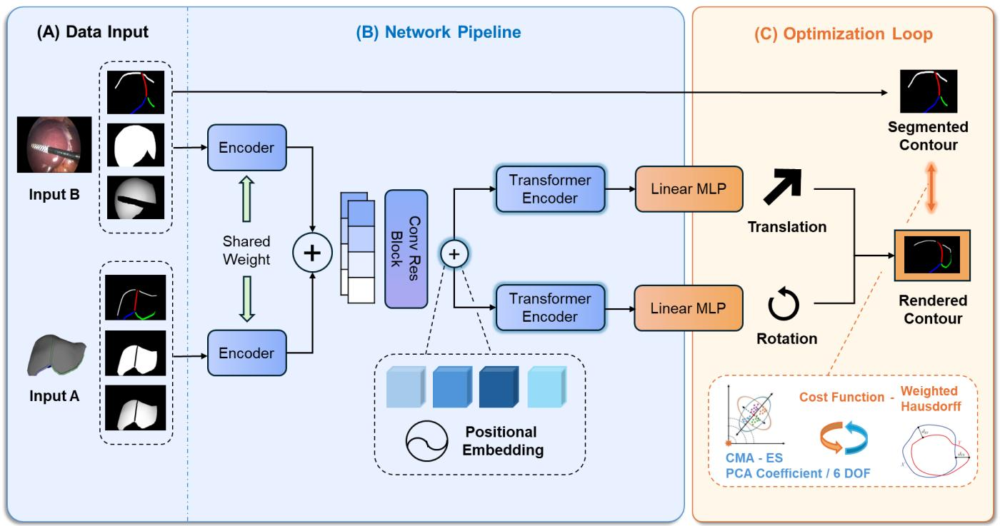
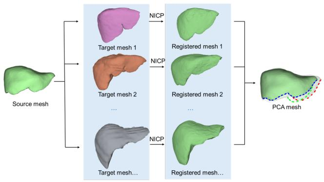
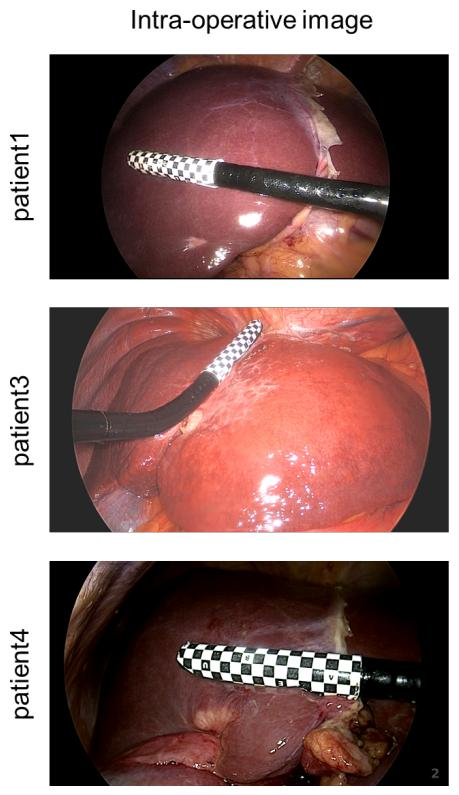
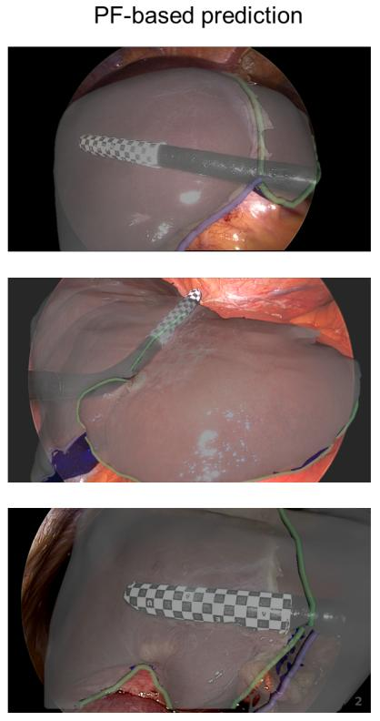
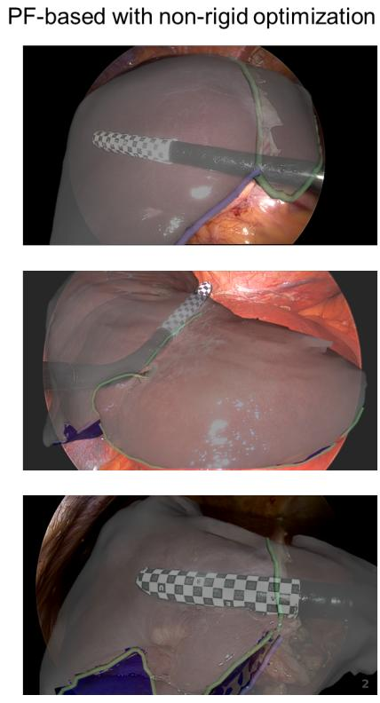

# FoundationPose-Initialized 3D–2D Liver Registration for Surgical Augmented Reality

Hanyuan Zhang1,Lucas He1,3,Runlong He1,Abdolrahim Kadkhodamohammadi4,Danail Stoyanov1, Brian R. Davidson1,2, Evangelos B. Mazomenos1,Matthew J. Clarkson1

Abstract— Augmented reality can improve tumor localization in laparoscopic liver surgery. Existing registration pipelines typically depend on organ contours; deformable (non-rigid) alignment is often handled with finite-element (FE) models coupled to dimensionality-reduction or machine-learning components. We integrate laparoscopic depth maps with a foundation pose estimator for camera-liver pose estimation and replace FE-based deformation with non-rigid iterative closest point (NICP) to lower engineering/modeling complexity and expertise requirements. On real patient data, the depthaugmented foundation pose approach achieved 9.91 mm mean registration error in 3 cases. Combined rigid-NICP registration outperformed rigid-only registration, demonstrating NICP as an efficient substitute for finite-element deformable models. This pipeline achieves clinically relevant accuracy while offering a lightweight, engineering-friendly alternative to FE-based deformation.

# I. INTRODUCTION

In laparoscopic liver surgery, localizing tumors and major vessels is difficult because internal structures are not directly visible. Intraoperative ultrasound partially mitigates this problem but is operator-dependent and increases cognitive load. Augmented reality (AR) overlays preoperative computed tomography (CT) on intraoperative endoscopic views to visualize tumors and critical anatomy, thereby improving surgical safety and precision [1], [2]. Achieving accurate overlays is challenging: the liver deforms under pneumoperitoneum, gravity, and contact, and only a small portion of the surface is visible during surgery. Registration errors exceeding 10 mm can potentially enlarge uncertainty during the laparoscopic surgery.[3]

Registering preoperative 3D liver meshes to 2D intraoperative images typically involves two stages. First, rigid initialization can be either manual or automatic. Automatic methods align organ contours and anatomical landmarks (left/right ridges, ligaments) between 3D meshes and 2D images [4]. End-to-end learning methods achieve comparable accuracy to optimization methods while running faster than manual or optimization-based pipelines [5], crucial for tracker-free systems requiring real-time performance during

surgery. However, most methods still rely on contour features alone, which can be ambiguous under varying lighting conditions and tissue deformation. In segmentation tasks, monocular depth maps like Depth Anything improve results [6], but whether depth information helps rigid initialization beyond contours remains untested in liver surgery. Reliable rigid initialization gives better starting points for non-rigid optimization.

The second stage, non-rigid registration, uses algorithms like Non-rigid Iterative Closest Point (NICP) and Coherent Point Drift (CPD) [7]. These methods need 3D surfaces reconstructed from intraoperative images, but partial liver visibility reduces their robustness. Finite element analysis (FEA) can handle non-rigid registration [5], but requires heavy computation and depends on uncertain, patientspecific material parameters. Liver stiffness and deformability differ between patients due to cirrhosis, steatosis, and chemotherapy-induced fibrosis, necessitating adaptive registration approaches[8].

Our main contributions are:

1) We leverage FoundationPose for relative pose regression of the liver in laparoscopic scenes and demonstrate how incorporating monocular depth maps significantly improves rigid initialization accuracy compared to contour-only approaches.   
2) We propose a novel preoperative deformation modeling pipeline that eliminates the computational burden of FEA while integrating the Covariance Matrix Adaptation Evolution Strategy (CMA-ES), demonstrating superior convergence and robustness over gradient-based optimization methods for non-rigid liver registration.

# II. RELATED WORKS

# A. Rigid Initialization in Liver Laparoscopic Surgery

Early video-to-CT registration methods used 3D–3D approaches, reconstructing intraoperative liver surfaces from video with laser range scanners [9], intraoperative CT [10], or stereo laparoscopes [11], [12].However, these approaches proved impractical: laser scanners cannot fit through trocar ports, intraoperative CT is rarely available, and stereo laparoscopes—despite enabling methods like globally optimal iterative closest point (Go-ICP) algorithm [12] and anterior ridge matching [11]—require specialized equipment while standard clinical practice uses monocular cameras. This hardware limitation has shifted focus toward methods that work with conventional monocular laparoscopes, though reliable

  
Fig. 1. The registration workflow diagram: The first stage adopts the Refine Net component from PoseFoundation by Wen et al., with the inputs replaced by the liver’s contour, mask, and depth images. The output is the contour, mask, and depth images re-rendered using the predicted pose.

depth estimation from single cameras remains challenging [13], [14].

Recent work has moved toward 3D–2D registration, which aligns 2D liver contours with projected 3D meshes. The Perspective-n-Point (PnP) algorithm with RANSAC provides rigid initialization [4], while Labrunie et al. achieved better results using non-rigid refinement [15] on a public dataset with intraoperative ground truth [16]. Learning-based approaches, such as the differentiable rendering framework from Montana-Brown et al. [17], face domain gaps between ˜ synthetic and intraoperative data. A deep-hashing variant shows good results on phantom data but lacks validation on real patient data, produces discrete poses instead of continuous ones, and still has view-direction ambiguities [18]. Hao et al. proposed a rigid scheme using patientspecific pre-training and staged landmark-weighted alignment, improving automation and speed [19]. Overall, relying solely on contours limits geometric information and worsens depth ambiguities when occlusions occur.

# B. Non-Rigid Registration in Liver Laparoscopic Surgery

Beyond rigid registration, recent research has turned to non-rigid deformation. Adagolodjo et al. combined finite element elastic models with projected contour constraints, solving for deformation directly through physical simulation, achieving good performance on clinical data [20]. Labrunie et al. also modeled liver elasticity with a Saint-Venant–Kirchhoff finite element model, starting from rigid registration. They estimated deformation by minimizing landmark and contour alignment errors together with internal

elastic energy [15]. Both approaches require complex biomechanical models.

Learning-based methods have emerged as well. Labrunie et al. combined finite element models with POD [21]/SVD to simulate deformations under different rigid poses, then trained a network for end-to-end non-rigid registration without needing rigid initialization [5]. While this approach has not matched the accuracy of optimization-based methods, it was the first to directly predict deformations using endto-end networks in liver laparoscopic surgery. More recent work used patient-specific MLPs trained on synthetic ARAPdeformed liver meshes [22]. With sampled 2D landmarks, this method predicts low-dimensional deformation coefficients, enabling near-real-time 3D–2D registration without initialization, matching the accuracy of optimization methods [23].

Existing 2D-3D registration methods predominantly rely on contour information, as monocular cameras inherently lack depth-sensing capabilities. Recent advances in learningbased depth estimation have yielded increasingly reliable depth maps. Despite providing only relative distances, this information offers valuable orientation cues—such as determining whether the left or right liver lobe is closer to the camera. Compared to contour-only approaches, depth incorporation offers richer guidance for registration.

# C. Pose Foundation

FoundationPose [24] recently demonstrated the effectiveness of integrating RGB-D input for 6D object pose estimation and tracking, achieving state-of-the-art generalization across model-based and model-free configurations

using synthetic training, implicit neural representations, and transformer architectures. These findings underscore the advantages of RGB-depth fusion for complex vision tasks. However, the integration of multi-class contour information with estimated depth remains unexplored in laparoscopic surgery. We hypothesize that this combination provides complementary cues that surpass contour-only methods, thereby enabling more robust and accurate orientation estimation for intraoperative guidance.

# III. METHOD

# A. Pose Offset Prediction

We adapt the RefineNet architecture from FoundationPose [24] to develop a patient-specific network for pose-offset prediction. The network takes three types of input:

1) Contour maps from the input images (right ridge, left ridge, ligaments, and silhouette)   
2) Full liver masks (including regions occluded by instruments);   
3) Liver depth maps excluding instrument occlusions, generated using Depth Anything V2 [25]

To address the domain gap between real and synthetic data, we augment the training data as follows. For contour maps, we first resize and skeletonize the contours, then apply random dilation to handle varying contour thicknesses, followed by random pixel deletion. For masks, we resize and apply either random dilation or erosion. For depth maps, we add random rectangular blocks of zero values to simulate instrument occlusions, then randomly scale the depth values.

Compared to the original MSE loss computed separately for rotation and translation, we adopt a surface MSE loss. Specifically, the predicted 6-DOF parameters are converted into transformation matrices T, which are then applied to the 3D mesh. The transformation matrices corresponding to image B (in Fig 1) are applied in the same manner, and the mean squared error between the two transformed surfaces is computed as the loss.

$$
\mathcal {L} _ {\mathrm {s u r f a c e}} = \frac {1}{N} \sum_ {i = 1} ^ {N} \left\| \mathbf {T} _ {A} \mathbf {T} _ {\mathrm {p r e d}} \mathbf {p} _ {i} - \mathbf {T} _ {B} \mathbf {p} _ {i} \right\| _ {2} ^ {2}, \tag {1}
$$

where $\mathbf { T } _ { A }$ and $\mathbf { T } _ { B }$ are the transformation matrices from the camera to the liver coordinate system for input images A and B (in Fig1), respectively, nd $\mathbf { T } _ { \mathrm { p r e d } }$ is the predicted relative transformation (offset) from image A to image B.

During inference stage, we currently use a manually annotated contours and masks as input B, as we assume such features can be determined by a wide variety of available networks. Input A is randomly selected from the training dataset, ensuring that it contains more than two types of contours. After obtaining $T _ { \mathrm { o f f s e t } }$ , the predicted value is used to render a new set of images, which is then placed in the position of A as the new input. This process is iterated until either ten iterations are reached or the predicted pose changes converge.

  
Fig. 2. PCA-based liver deformation model. A reference liver mesh (source) is registered to multiple deformed liver configurations (targets) using NICP to establish vertex correspondence. [26]. PCA analysis of these aligned meshes extracts the first ten principal deformation modes. Linear combinations of these modes generate new plausible deformations, shown as red and green dashed contours, while the solid green contour represents the mean shape.

# B. Pre-Operative Non-rigid Data Collection

We first used a liver dataset from the work of Montana-Brown et al[26] and removed all samples that did not contain a whole liver. All remaining livers were aligned to have the same orientation as the patient’s liver 3D mesh using the Iterative Closest Point (ICP) algorithm. Next, taking the patient’s liver as the source mesh and each liver in the dataset as the target mesh, we performed Non-Rigid ICP registration using the implementation of Foti et al.[27], [28]. This yielded new liver shapes representing the same liver under different non-rigid deformations. Principal Component Analysis (PCA) was then applied to the registered liver shapes to reduce dimensionality, and the first ten principal components were extracted for subsequent non-rigid optimization, see in Fig 2.

The Non-rigid Iterative Closest Point (NICP) algorithm extends traditional ICP by enabling mesh registration with flexible deformation while preserving topological structure. Unlike rigid ICP methods, NICP allows local deformations through optimization of an energy function that balances shape preservation constraints with data fitting terms.

The NICP algorithm was adopted from [29]. At each iteration, NICP solves a sparse linear system derived from minimizing an energy function with rigidity and data terms:

$$
\left[ \begin{array}{l} \alpha \mathbf {W} \otimes \mathbf {S} \\ \mathbf {D} \cdot \mathbf {M} \end{array} \right] \mathbf {x} = \left[ \begin{array}{l} \mathbf {0} \\ \mathbf {P} \end{array} \right], \tag {2}
$$

where S is the node-arc incidence matrix encoding mesh connectivity, W the transformation weight matrix, α the rigidity weight, and x the affine transformation parameters. This formulation enforces consistent local transformations and preserves mesh structure.

To capture non-rigid deformations, a coarse-to-fine schedule of rigidity weights

$$
\pmb {\alpha} = [ 2 0, 1 0, 5, 2, 1, 0. 5, 0. 2 ]
$$

is used, progressively relaxing rigidity constraints.

At each stage, correspondences are found via nearest-point search, with a normal-consistency filter:

$$
w _ {i} = \gamma \quad \mathrm {i f} \mathbf {n} _ {i} \cdot \mathbf {n} _ {i} ^ {*} > \theta , \theta = 0. 7,
$$

and $w _ { i } = 0$ otherwise. This prevents spurious matches.

The linear system is then assembled as

$$
\mathbf {A} = \left[ \begin{array}{l} \alpha_ {k} (\mathbf {W} \otimes \mathbf {S}) \\ \operatorname {d i a g} (\mathbf {w}) \cdot \mathbf {D} \end{array} \right], \quad \mathbf {b} = \left[ \begin{array}{l} \mathbf {0} \\ \mathbf {W} \odot \mathbf {P} ^ {*} \end{array} \right], \tag {3}
$$

and solved with Tikhonov regularization:

$$
\mathbf {x} ^ {(k + 1)} = \arg \min  _ {\mathbf {x}} \| \mathbf {A} \mathbf {x} - \mathbf {b} \| _ {2} ^ {2} + \lambda \| \mathbf {x} \| _ {2} ^ {2}, \quad \lambda = 1 0 ^ {- 6}. \quad (4)
$$

Updated vertex positions are computed as

$$
\mathbf {V} ^ {(k + 1)} = \mathbf {D} \mathbf {x} ^ {(k + 1)}.
$$

# C. Non-Rigid Optimization

We refine both the rigid pose and the statistical shape parameters by minimizing a weighted Hausdorff distance between rendered model contours and input label mask contours. Label weights $w _ { n }$ are proportional to the number of labeled pixels per channel (uniform when no annotations are present), which balances contributions across anatomical structures and views.

Since the Hausdorff distance is non-differentiable, gradient-based optimizers are not applicable. Instead, we employ the gradient-free Covariance Matrix Adaptation Evolution Strategy (CMA-ES), a stochastic, derivative-free algorithm that iteratively samples in the parameter space and adapts its covariance matrix to progressively approximate the global optimum. This makes CMA-ES particularly suitable for handling the non-convex and non-differentiable objective in our problem.

The optimization is performed under bounded search constraints: PCA shape coefficients are restricted to [−1, 1] to avoid extrapolation beyond the statistical shape space, while pose parameters are constrained within ±20 mm and $\pm 1 0 ^ { \circ }$ of the initialization $( \mathbf { T } _ { 0 } , \mathbf { R } _ { 0 } )$ . The optimization yields the refined rigid pose Pose⋆ and shape coefficients $\pmb { \alpha } ^ { \star } \left( \mathbf { A l g . \mu } \mathbb { 1 } \right)$ .

$$
\mathcal {L} (\mathbf {T}, \mathbf {R}, \boldsymbol {\alpha}) = \sum_ {n} w _ {n} d _ {H} \left(\mathcal {C} _ {n} (\mathbf {T}, \mathbf {R}, \boldsymbol {\alpha}), \mathcal {C} _ {n} ^ {\mathrm {g t}}\right) \tag {5}
$$

where $n \in \{ \mathrm { r i d g e } _ { R } , \mathrm { r i d g e } _ { L } , \mathrm { l i g } , \mathrm { s i l } \}$ .

# IV. EXPERIMENTS

# A. Rigid Offest Prediction

a) Data Generation: We first manually place the liver model at a viewpoint where at least three contours are visible and use this pose as the initialization. We then randomly sample $5 \times 1 0 ^ { 5 }$ poses by applying translations in [−50, 50] mm and rotations in $[ - 2 0 ^ { \circ } , 2 0 ^ { \circ } ]$ , and render mask, contour, and depth (the depth rendered via the z-buffer) for each pose. Images with fewer than two contour types are discarded. The dataset is split 90%/10% for training/validation, and we select the checkpoint with the lowest validation loss.

Algorithm 1: Pose–Shape Refinement Using Weighted Hausdorff and CMA-ES   
\begin{array}{l} \textbf {I n p u t : R i g i d i n i t i z a t i o n (T _ {0} , R _ {0}) ; m e a n s h a p e S ;} \\ \textbf {P C A b a s e s} \{B _ {k} \} _ {k = 1} ^ {1 0}; \textbf {i n p u t l a b e l m a s k s} \\ \{L _ {n} \} _ {n = 1} ^ {4}; \\ \textbf {r e n d e r o p e r a t o r R e n d e r C o n t o u r (\cdot) ; H a u s d o r f f} \\ \textbf {d i s t a n c e H a u s d o r f f (\cdot , \cdot) .} \\ \textbf {O u t p u t : O p t i z e d p o s e P o s e ^ {\star} a n d P C A s c o r e s \alpha^ {\star} .} \\ \textbf {1} N \leftarrow \sum_ {n = 1} ^ {4} | L _ {n} |; w _ {n} \leftarrow | L _ {n} | / N \text {i f} N > 0, \text {e l s e} \\ w _ {n} \leftarrow 1 / 4 \\ \textbf {2} \theta_ {0} \leftarrow [ \mathbf {T} _ {0}, \mathbf {R} _ {0}, \mathbf {0} _ {1 0} ] \\ \textbf {3} \text {b o u n d s} \leftarrow [ \mathbf {T} _ {0} \pm 2 0 \mathrm {m m}, \mathbf {R} _ {0} \pm 1 0 ^ {\circ}, [ - 1, 1 ] ^ {1 0} ] \\ \textbf {4} \textbf {F u n c t i o n O b j e c t i v e} (\pmb {\theta}): \\ \textbf {5} \left( \begin{array}{l} (\mathbf {T}, \mathbf {R}, \pmb {\alpha}) \leftarrow \text {u n p a c k} (\pmb {\theta}) \\ S \leftarrow \bar {S} + \sum_ {k = 1} ^ {1 0} \alpha_ {k} B _ {k} \\ H \leftarrow 0 \\ \textbf {f o r} n = 1, \dots , 4 \textbf {d o} \\ \textbf {i f} w _ {n} = 0 \textbf {t h e n} \\ \textbf {l} \textbf {c o n t i n u e} \\ C _ {n} ^ {\mathrm {m o d e l}} \leftarrow \text {R e n d e r C o n t o u r} (S, (\mathbf {T}, \mathbf {R}), n) \\ C _ {n} ^ {\mathrm {i n p u t}} \leftarrow \text {E x t r a c t C o n t o u r} (L _ {n}) \\ H \leftarrow H + w _ {n} \cdot \text {H a u s d o r f f} (C _ {n} ^ {\mathrm {m o d e l}}, C _ {n} ^ {\mathrm {i n p u t}}) \\ \textbf {4} \textbf {r e t u r n} H \end{array} \right. \\ \textbf {5} \pmb {\theta} ^ {\star} \leftarrow \text {C M A - E S (O b j e c t i v e ,} \pmb {\theta} _ {0}, \text {b o u n d s}) \\ \textbf {6} \textbf {E x t r a c t P o s e} ^ {\star} \textbf {a n d} \pmb {\alpha} ^ {\star} \textbf {f r o m} \pmb {\theta} ^ {\star}. \end{array}

b) Contour Augmentations.: Skeletonization is performed using the Zhang–Suen thinning algorithm, followed by dilation with a $2 \times 2$ cross-shaped kernel and a random number of iterations $r ~ \in ~ \{ 1 , 2 , 3 \}$ . Random occlusion is applied by placing up to three rectangles, each spanning 20% of the image width and height. Elastic deformation remaps the image using random displacement fields smoothed with a Gaussian $( \sigma = 4 )$ and scaled by $\alpha = 1 0$ . This pipeline introduces structural variation, occlusion, and non-rigid deformation while preserving semantic consistency.

c) Mask Augmentation.: For binary masks, we apply a stochastic morphological jitter with probability $p _ { \mathrm { m a s k } } = 0 . 5 .$ An operation $o \in$ {erosion, dilation} is sampled uniformly, and the kernel size k is drawn uniformly from the integer range [2, 6] and then made odd (if even, set $k \gets k + 1 )$ . We use an elliptical structuring element of size k×k and perform a single iteration. This produces mild contour shrink/expand effects while preserving mask semantics.   
d) Depth Augmentation: Valid pixels are defined as $z >$ 0 (zeros denote occlusion). We apply the following stochastic operators to valid pixels:

1) Rotated rectangle occluder $( p ~ = ~ 0 . 4 ) \colon$ : render $N \in$ {1, 2} filled rectangles with random centers and angles $\theta \ \sim \ \mathcal { U } [ - 4 5 ^ { \circ } , 4 5 ^ { \circ } ]$ . Rectangle length $L \sim$ $\mathcal { U } [ 1 0 0 , 4 0 0 ]$ px and width $W \ \sim \ \mathcal { U } [ 8 , 2 5 ]$ px are clamped to the image bounds. Mask values $> 1 2 8$ are

  
Fig. 3. The registration results of the first-frame images for Patient 1, 3, and 4. The leftmost column shows the input intra-operative image. The second column presents the rigid pose estimation result obtained by iterative prediction using the FoundationPose model, overlaid on the intra-operative image. The rightmost column shows the result after further non-rigid refinement.

treated as occluded and set to zero.

2) Random erasing $( p \ = \ 0 . 4 ) \colon$ erase $N ~ \in ~ \{ 0 , 1 , 2 \}$ axis-aligned patches to zero. Patch sizes are sampled per image as $w ~ \in ~ [ \vert W _ { \mathrm { i m g } } / 2 0 \vert , ~ \vert W _ { \mathrm { i m g } } / 8 \vert ]$ and $h \in$ $[ \lfloor H _ { \mathrm { i m g } } / 2 0 \rfloor , \lfloor H _ { \mathrm { i m g } } / \bar { 8 } \ ] ]$ , with an overall erasing ratio constrained to $[ 0 . 0 5 , 0 . 2 5 ]$ .   
3) Depth normalization $( p \ = \ 0 . 5 ) \colon$ let $z _ { \mathrm { m i n } } , z _ { \mathrm { m a x } }$ be the min/max over valid pixels. Compute $\tilde { z } ~ = ~ ( z ~ -$ $z _ { \mathrm { m i n } } ) / ( z _ { \mathrm { m a x } } - z _ { \mathrm { m i n } } )$ , rescale to a random interval $[ a , b ]$ with $a \sim \mathcal { U } [ 0 . 0 , 0 . 2 ] , b \sim \mathcal { U } [ 0 . 8 , 1 . 0 ]$ , then map to [0, 255]. Invalid (zero) pixels remain zero.   
4) Scale perturbation $( p = 0 . 6 )$ : apply $z ^ { \prime } = s z + \Delta +$ ϵ, where $s \sim \mathcal { U } [ 0 . 7 , 1 . 3 ] , \Delta \sim \mathcal { U } [ - 3 0 , 3 0 ]$ , and $\epsilon \sim$ ${ \mathcal { N } } ( 0 , \sigma ^ { 2 } )$ with $\sigma \sim \mathcal { U } [ 0 . 0 1 , 0 . 0 5 ] \times 2 5 5$ .

e) Experiment Setup.: We trained using the Adam optimizer with a learning rate of $1 \times 1 0 ^ { - 4 }$ , a batch size of 32, and 50 epochs. All experiments were conducted on NVIDIA RTX 4090 (24 GB) and A100 (80 GB) GPUs.   
f) Inference: We use the dataset of Rabbani et al. [16], which provides intraoperative data from four patients with 8–21 frames per patient. Tumor locations were localized intraoperatively using ultrasound, enabling quantitative validation for AR-guided surgery.

In line with prior works [5], [15], [20], Patient 2 exhibits consistently poor performance across methods. A closer inspection reveals that the liver of Patient 2 underwent a major torsion during image acquisition, which fundamentally alters its geometry and makes reliable registration extremely

difficult. As a result, even expert manual registration still leads to an error of about 35 mm, and optimization-based methods fail to reach clinically meaningful accuracy. Since learning-based approaches rely on synthetic data generated in a manner consistent with optimization-based rendering pipelines, their achievable accuracy is effectively bounded by these methods, making it unrealistic to expect improvements in this particular case. Indeed, several prior studies explicitly report results both with and without Patient 2 to account for this limitation[5], [23], [15]. Based on these observations, we conclude that the reference value of Patient 2 is limited, and therefore focus our evaluation primarily on Patients 1, 3, and 4.

Each frame was manually segmented. At inference stage, we initialize the pose from a randomly sampled pose in the training set and perform iterative refinement. The procedure terminates when the translation update magnitude falls below 1 mm or when 10 iterations are reached. Once the pose estimation of the first frame is completed, the initial guess for each subsequent frame is set to the result of the previous frame.

# B. NICP Data Preparation and Optimization.

After sampling from [26] , we obtained 398 whole liver meshes from distinct patients. We used these meshes as targets and fitted our prepared liver to each of them. For each target, we computed per-vertex displacement vectors relative to the liver and stacked them into a data matrix; PCA on

<table><tr><td>Method</td><td>P1</td><td>P2</td><td>P3</td><td>P4</td><td>Avg</td><td>Avg w/o P2</td></tr><tr><td>MA</td><td>15.14</td><td>35.48</td><td>30.48</td><td>16.29</td><td>30.43</td><td>20.63</td></tr><tr><td>LMR[5]</td><td>17.40</td><td>53.80</td><td>17.6</td><td>17.0</td><td>26.45</td><td>17.33</td></tr><tr><td>NM[23]</td><td>14.82</td><td>51.43</td><td>20.15</td><td>12.95</td><td>24.83</td><td>15.87</td></tr><tr><td>Opt-B[15]</td><td>14.87</td><td>N/A</td><td>22.40</td><td>7.23</td><td>—</td><td>14.83</td></tr><tr><td>FoundationPose w/o depth</td><td>14.74</td><td>N/A</td><td>12.71</td><td>20.14</td><td>—</td><td>15.86</td></tr><tr><td>FoundationPose</td><td>12.94</td><td>N/A</td><td>8.11</td><td>8.69</td><td>—</td><td>9.91</td></tr><tr><td>+ rigid opt.</td><td>10.63</td><td>N/A</td><td>11.08</td><td>12.58</td><td>—</td><td>11.43</td></tr><tr><td>+ non-rigid opt.</td><td>7.64</td><td>N/A</td><td>8.38</td><td>9.54</td><td>—</td><td>8.52</td></tr></table>

these displacements yields a low-dimensional subspace that captures plausible local shape variation. Let $\mathbf { x } _ { 0 } \in \mathbb { R } ^ { 3 V }$ be the canonical shape, and let PCA produce components U with standard deviations σ. We parameterize shapes as

$$
\mathbf {x} (\boldsymbol {\alpha}) = \mathbf {x} _ {0} + \mathbf {U} \mathrm {d i a g} (\boldsymbol {\sigma}) \boldsymbol {\alpha},
$$

and clamp the normalized coefficients to $\pmb { \alpha } \in [ - 1 , 1 ] ^ { K }$ to prevent unrealistic deformations.

For non-rigid ICP, we optimize the PCA coefficients (and pose, if applicable) using CMA–ES with bounded search. Unless otherwise stated, we use the following configuration: maxiter = 100, popsize = 15, verbose = -1, CMA diagonal = False. The bounds are derived from the coefficient limits (and pose limits when optimized). This setup favors small, anatomically plausible deformations while avoiding overfitting and excessive non-physical warping.

We follow the common CMA–ES heuristic for the population size[30],

$$
\lambda = 4 + \lfloor 3 \ln n \rfloor ,
$$

where n is the number of optimized variables. In our case, n = 16 (PCA coefficients and pose, when applicable). To slightly increase robustness under box constraints, we set $\lambda = 1 5 \ ( { \tt p o p s i z e } \ = \ 1 5 )$ .

# C. Ablation Studies

To evaluate the contribution of each component in our registration pipeline, we conducted ablation studies on both the rigid and non-rigid optimization stages. For the rigid registration stage, we compared two input configurations to the FoundationPose network: (1) contour maps with liver masks only, and (2) the full configuration combining contour maps, masks, and laparoscopic depth information. Both configurations were trained and validated on identical data splits to ensure fair comparison. For the non-rigid optimization stage, we evaluated the impact of shape deformation by comparing: (1) optimization over 6-DoF rigid pose parameters only, and (2) joint optimization over 6-DoF pose and ten PCA-derived shape coefficients. This comparison quantifies the benefit of incorporating non-rigid deformation into the registration pipeline. The quantitative results of these ablations are presented in Table I.

# V. RESULTS AND CONCLUSION

Comparison with baseline methods shows that FoundationPose initialization outperformed previous methods with a mean error of 9.91 mm, particularly excelling on Patients 3 and 4. Counterintuitively, rigid optimization degraded performance to 11.43 mm–a known phenomenon when optimizing from near-optimal initial poses. We hypothesize that this degradation occurs because optimization-based approaches primarily rely on contour alignment while ignoring depth information; under the camera viewing direction, even small 2D displacements can correspond to considerable 3D discrepancies, which may worsen the results. Nevertheless, compared with earlier optimization-based methods and manual alignment, our rigid stage remained competitive. The subsequent non-rigid stage not only recovered these losses but achieved the lowest overall error of 8.52 mm. This final stage particularly benefited Patient 1 (12.94 to 7.64 mm), while maintaining reasonable accuracy for the wellinitialized Patients 3 and 4.

In our experiments, the rigid initialization typically converged within a few seconds per frame, whereas the non-rigid refinement required ∼ 30–60 s depending on mesh resolution and the number of optimization iterations. Because the camera is tracked, after completing the first-frame registration, subsequent frames can be updated in real time by composing the tracker’s incremental pose $T _ { \mathrm { d i f f } }$ with the previously estimated deformation and re-rendering, under a quasi-static deformation assumption $( \mathrm { i . e . , }$ within the same visualization phase without major resections). In practice, this reduces per-frame latency to rendering-only costs, with non-rigid optimization re-invoked only when substantial deformation is observed.

For the pose estimation task, we can conclude that even when accurate absolute depth maps are not available, depth maps estimated by depth estimation networks can still improve model accuracy. This observation is consistent with the findings of FoundationPose. For the non-rigid registration part, we observed that the Hausdorff distance decreased during optimization, indicating that the predicted liver mesh contours became increasingly close to the input. Based on preliminary results [18], the results showed that the Hausdorff distance serves as an effective optimization cost function. However, in this case, the performance for Patient 3 and 4 slightly decreased. We hypothesize that this is because

the NICP algorithm only accounts for surface alignment, while changes in internal tumors are not effectively mapped. Compared with more sophisticated finite element analysis (FEA) approaches, NICP does not rely on complex biomechanical modeling, but it also fails to achieve the same level of accuracy for internal tumor tracking.

Another limitation is that we excluded Patient 2 from quantitative evaluation due to extreme torsion, as detailed in Experiment section(IV-A.0.f). This case is well-known in prior works [5], [15], [23] as being nearly impossible to register reliably, and thus does not provide meaningful reference values. We highlight it as an important challenge case for future research.

In addition, the number of publicly available datasets with tumor-level TRE annotations is currently extremely limited; to the best of our knowledge, the dataset of Rabbani et al.[16] is the only source that enables such quantitative validation for AR-guided liver surgery. This scarcity inevitably constrains the statistical significance of our evaluation. As part of future work, we plan to complement patient data with phantombased experiments, which will allow controlled ground-truth validation and strengthen the credibility of our quantitative findings.

It is also worth noting that although the numerical error was low, the qualitative results revealed clear visual improvements for Patient 1 and Patient 4. For Patient 3, despite the low error and suboptimal alignment of the left lobe, the alignment of the right lobe improved. Since the tumor was not located in the right lobe, this improvement contributed to the observed decrease in error, even though the clinically relevant alignment was less satisfactory. Future work will further explore mapping strategies that achieve accuracy comparable to FEA while maintaining the computational simplicity of our approach. In conclusion, our hybrid approach achieves state-of-the-art performance on challenging laparoscopic liver registration tasks, with the combination of depth-enhanced FoundationPose initialization and non-rigid optimization providing both accuracy and computational efficiency suitable for clinical deployment.

# REFERENCES

[1] J. Ramalhinho, S. Yoo, T. Dowrick, B. Koo, M. Somasundaram, K. Gurusamy, D. J. Hawkes, B. Davidson, A. Blandford, and M. J. Clarkson, “The value of augmented reality in surgery—a usability study on laparoscopic liver surgery,” Medical Image Analysis, vol. 90, p. 102943, 2023.   
[2] C. Schneider, S. Thompson, J. Totz, Y. Song, M. Allam, M. Sodergren, A. Desjardins, D. Barratt, S. Ourselin, K. Gurusamy et al., “Comparison of manual and semi-automatic registration in augmented reality image-guided liver surgery: a clinical feasibility study,” Surgical endoscopy, vol. 34, no. 10, pp. 4702–4711, 2020.   
[3] S. Ali, Y. Espinel, Y. Jin, P. Liu, B. Guttner, X. Zhang, L. Zhang, ¨ T. Dowrick, M. J. Clarkson, S. Xiao et al., “An objective comparison of methods for augmented reality in laparoscopic liver resection by preoperative-to-intraoperative image fusion from the miccai2022 challenge,” Medical image analysis, vol. 99, p. 103371, 2025.   
[4] B. Koo, M. R. Robu, M. Allam, M. Pfeiffer, S. Thompson, K. Gurusamy, B. Davidson, S. Speidel, D. Hawkes, D. Stoyanov et al., “Automatic, global registration in laparoscopic liver surgery,” International Journal of Computer Assisted Radiology and Surgery, vol. 17, no. 1, pp. 167–176, 2022.

[5] M. Labrunie, D. Pizarro, C. Tilmant, and A. Bartoli, “Automatic 3d/2d deformable registration in minimally invasive liver resection using a mesh recovery network.” in MIDL, 2023, pp. 1104–1123.   
[6] J. Pei, R. Cui, Y. Li, W. Si, J. Qin, and P.-A. Heng, “Depthdriven geometric prompt learning for laparoscopic liver landmark detection,” in International Conference on Medical Image Computing and Computer-Assisted Intervention. Springer, 2024, pp. 154–164.   
[7] B. Kundu, Z. Yang, R. Simon, and C. Linte, “Comparative analysis of non-rigid registration techniques for liver surface registration,” in Medical Imaging 2024: Image-Guided Procedures, Robotic Interventions, and Modeling, vol. 12928. SPIE, 2024, pp. 520–526.   
[8] A. S. Lemine, Z. Ahmad, N. J. Al-Thani, A. Hasan, and J. Bhadra, “Mechanical properties of human hepatic tissues to develop livermimicking phantoms for medical applications,” Biomechanics and Modeling in Mechanobiology, vol. 23, no. 2, pp. 373–396, 2024.   
[9] M. Fusaglia, H. Hess, M. Schwalbe, M. Peterhans, P. Tinguely, S. Weber, and H. Lu, “A clinically applicable laser-based image-guided system for laparoscopic liver procedures,” International journal of computer assisted radiology and surgery, vol. 11, no. 8, pp. 1499– 1513, 2016.   
[10] E. Pelanis, A. Teatini, B. Eigl, A. Regensburger, A. Alzaga, R. P. Kumar, T. Rudolph, D. L. Aghayan, C. Riediger, N. Kvarnstrom¨ et al., “Evaluation of a novel navigation platform for laparoscopic liver surgery with organ deformation compensation using injected fiducials,” Medical image analysis, vol. 69, p. 101946, 2021.   
[11] M. R. Robu, J. Ramalhinho, S. Thompson, K. Gurusamy, B. Davidson, D. Hawkes, D. Stoyanov, and M. J. Clarkson, “Global rigid registration of ct to video in laparoscopic liver surgery,” International Journal of Computer Assisted Radiology and Surgery, vol. 13, no. 6, pp. 947–956, 2018.   
[12] H. Luo, D. Yin, S. Zhang, D. Xiao, B. He, F. Meng, Y. Zhang, W. Cai, S. He, W. Zhang et al., “Augmented reality navigation for liver resection with a stereoscopic laparoscope,” Computer methods and programs in biomedicine, vol. 187, p. 105099, 2020.   
[13] Y. Zhang, Y. Zou, and P. X. Liu, “Point cloud registration in laparoscopic liver surgery using keypoint correspondence registration network,” IEEE Transactions on Medical Imaging, 2024.   
[14] Z. Yang, R. Simon, and C. A. Linte, “Learning feature descriptors for pre-and intra-operative point cloud matching for laparoscopic liver registration,” International journal of computer assisted radiology and surgery, vol. 18, no. 6, pp. 1025–1032, 2023.   
[15] M. Labrunie, M. Ribeiro, F. Mourthadhoi, C. Tilmant, B. Le Roy, E. Buc, and A. Bartoli, “Automatic preoperative 3d model registration in laparoscopic liver resection,” International Journal of Computer Assisted Radiology and Surgery, vol. 17, no. 8, pp. 1429–1436, 2022.   
[16] N. Rabbani, L. Calvet, Y. Espinel, B. Le Roy, M. Ribeiro, E. Buc, and A. Bartoli, “A methodology and clinical dataset with ground-truth to evaluate registration accuracy quantitatively in computer-assisted laparoscopic liver resection,” Computer Methods in Biomechanics and Biomedical Engineering: Imaging & Visualization, vol. 10, no. 4, pp. 441–450, 2022.   
[17] N. Montana-Brown, J. Ramalhinho, B. Koo, M. Allam, B. Davidson, ˜ K. Gurusamy, Y. Hu, and M. J. Clarkson, “Towards multi-modal self-supervised video and ultrasound pose estimation for laparoscopic liver surgery,” in International Workshop on Advances in Simplifying Medical Ultrasound. Springer, 2022, pp. 183–192.   
[18] H. Zhang, S. Bulathsinhala, B. R. Davidson, M. J. Clarkson, and J. Ramalhinho, “Deep hashing for global registration of preoperative ct and video images for laparoscopic liver surgery,” International Journal of Computer Assisted Radiology and Surgery, pp. 1–9, 2025.   
[19] J. Hao, B. He, Y. Dai, Y. Li, Y. Wang, R. Zhao, R. Lian, X. Zeng, H. Tao, J. Yang et al., “A 3d-2d rigid liver registration method using pre-training and transfer learning with staged alignment of anatomical landmarks,” International Journal of Imaging Systems and Technology, vol. 35, no. 4, p. e70124, 2025.   
[20] Y. Adagolodjo, R. Trivisonne, N. Haouchine, S. Cotin, and H. Courtecuisse, “Silhouette-based pose estimation for deformable organs application to surgical augmented reality,” in 2017 IEEE/RSJ International Conference on Intelligent Robots and Systems (IROS). IEEE, 2017, pp. 539–544.   
[21] E. Sifakis and J. Barbic, “Fem simulation of 3d deformable solids: a practitioner’s guide to theory, discretization and model reduction,” in Acm siggraph 2012 courses, 2012, pp. 1–50.   
[22] O. Sorkine and M. Alexa, “As-rigid-as-possible surface modeling,” in Symposium on Geometry processing, vol. 4, 2007, pp. 109–116.

[23] I. Mhiri, D. Pizarro, and A. Bartoli, “Neural patient-specific 3d–2d registration in laparoscopic liver resection,” International Journal of Computer Assisted Radiology and Surgery, vol. 20, no. 1, pp. 57–64, 2025.   
[24] B. Wen, W. Yang, J. Kautz, and S. Birchfield, “Foundationpose: Unified 6d pose estimation and tracking of novel objects,” in Proceedings of the IEEE/CVF Conference on Computer Vision and Pattern Recognition, 2024, pp. 17 868–17 879.   
[25] L. Yang, B. Kang, Z. Huang, Z. Zhao, X. Xu, J. Feng, and H. Zhao, “Depth anything v2,” Advances in Neural Information Processing Systems, vol. 37, pp. 21 875–21 911, 2024.   
[26] N. Montana-Brown, S. U. Saeed, A. Abdulaal, T. Dowrick, Y. Kilic, S. Wilkinson, J. Gao, M. Mashar, C. He, A. Stavropoulou et al., “Saramis: Simulation assets for robotic assisted and minimally invasive surgery,” Advances in Neural Information Processing Systems, vol. 36, pp. 26 121–26 134, 2023.   
[27] S. Foti, B. Koo, T. Dowrick, J. Ramalhinho, M. Allam, B. Davidson, D. Stoyanov, and M. J. Clarkson, “Intraoperative liver surface completion with graph convolutional vae,” in International Workshop on Uncertainty for Safe Utilization of Machine Learning in Medical Imaging. Springer, 2020, pp. 198–207.   
[28] S. Foti, “Meshpreprocessing: A library for mesh registration and non-rigid icp,” GitHub repository, 2020, available: https://github.com/simofoti/MeshPreprocessing [Accessed: Sep. 11, 2025].   
[29] B. Amberg, S. Romdhani, and T. Vetter, “Optimal step nonrigid icp algorithms for surface registration,” in 2007 IEEE conference on computer vision and pattern recognition. IEEE, 2007, pp. 1–8.   
[30] H. Nikolaus, “The cma evolution strategy: A tutorial,” arXiv preprint arXiv: 1604.00772, 2016.