# 2024年第一学期第一、二单元综合测评卷一年级语文

(时间：90分 满分：100分)

<table><tr><td>题号</td><td>一</td><td>二</td><td>三</td><td>四</td><td>五</td><td>总分</td></tr><tr><td>得分</td><td></td><td></td><td></td><td></td><td></td><td></td></tr></table>

一、拼音字母知识基础。（本大题共3小题，第1小题9分，第2小题10分，第3小题6分；本大题共25分）

1.根据题目按顺序填写字母。（本题共11小题，每空1分，共9分）

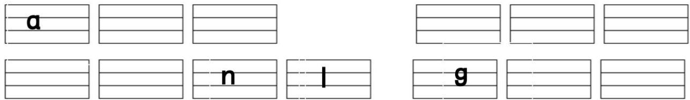

2.照样子，把字母改写成整体认读音节。（本题共5小题，每空2分，共10分）

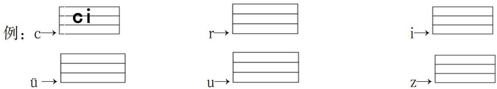

3.按要求分一分。（本题共3小题，每小题2分，共6分）

①yu

$②$ yin g

③W

④lian g

⑤p

(6)ri

⑦quan

⑧yun

⑨ye

⑩wu

1.声母：  
2.三拼音节：  
3.整体认读音节：

二、拼音音节拼写与拼读。（本大题共3小题，第1小题8分，第2小题11分，第3小题10分；共29分）

1.拼一拼，选一选，在正确的读音后面打“√”。（本题共4小题，共8分）

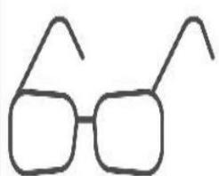

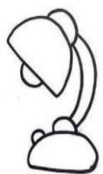

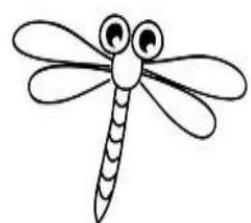

yǎnjìn (  ) táidēn (  ) qīng tín (  ) mì fōng (  )

yǎn jìng ( ) táidēng ( ) qīng tíng ( ) mì fēng ( )

2.读一读，填一填。（本题共9小题，每空1分，共11分）

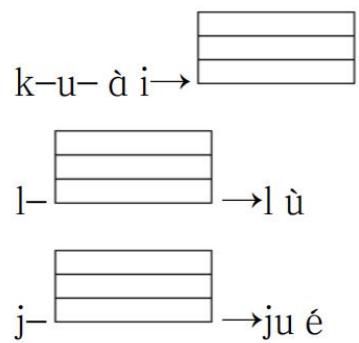

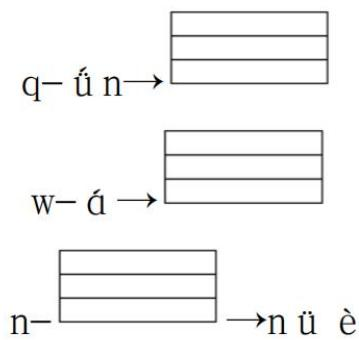

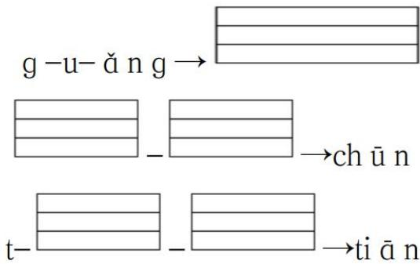

3.读一读下列句子，用“_”画出错误的音节并改正。（本题每空1分，共10分）

(1) zì jǐ de sì qing zì jǐ zhuò.

（ ）--（ ） （ ）--（ ）

(2) xiǎo wén hé dà da zài zhé zi.

（ ）--（ ） （ ）--（ ） （ ）--（ ）

# 三、按要求完成题目。（本大题共3小题，第1小题8分，第2小题9分，第3小题8分；共25分）

1.按要求变新字再组词。（本题共4小题，每小题2分，共8分）

加一笔：人→（ ）

口→ （ ）

加两笔：人→ （ ）

口→ （ ）

2.圈一圈，填一填。（本题共2小题，共9分）

（1）从图中找到“山”“花朵”“云”，并用“◎”圈起来。（共3分）

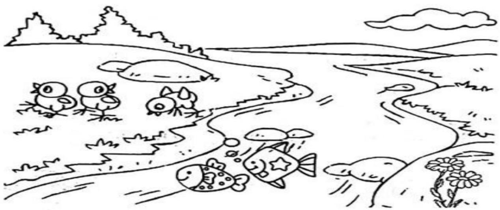

（2）选择合适的量词填空。(填序号）（共6分）

(1)只

②朵

(3)座

(4)条

一（ ）山

一（ ）花

一（ ）鸟

一（ ）鱼

一（ ）鸡

一（ ）云

3.口语交际，选择合适的词语填空。（本题共4小题，每小题2分，共8分）

(1)早上好

(2)请

（1）有事请人帮忙，你要说：“

(1) 谢谢

(2)对不起

（2）别人帮助里你，你要说：“

(1)来啦

②早上好

（3）早上上学见到老师，你要说：“老师，

(1)对不起

(2)没关系

（4）你不小心弄坏同桌的铅笔，你要说：“________。”

# 四、阅读短文，回答问题。（本大题共4小题，第1小题2分，第2小题3分，第3小题3分，第4小题2分；本大题共10分）

chi péng gē

翅膀歌

yàn zǐ shì chūntiān de chì páng

燕子是春天的翅膀。

qingting shi xià tiān de chi páng

蜻蜓是夏天的翅膀。

da yan shi qiu tian de chipang

大雁是秋天的翅膀。

xuehua shidongtian dechipang

雪花是冬天的翅膀。

Ii xiang shi wom de chi pang

理想是我们的翅膀，

zhàn chí xiàng wèi lái fēi xiáng

展翅向未来飞翔。

1.这首儿歌共有（ ）句话。（2分）

2.这首儿歌中出现的小动物有哪些？用“○”圈出来。（3分）

3.儿歌中出现了哪几个季节？（ ）（多选题）（3分）

①春天

(2)夏天

③秋天

④冬天

4. 什么是“我们”的翅膀？请你用“ ”画出来。（2分）

五、看图写话。（本大题共1小题，请将答案书写在下方的答题纸上，注意书写要清洗，卷面要整洁；本大题共9分）

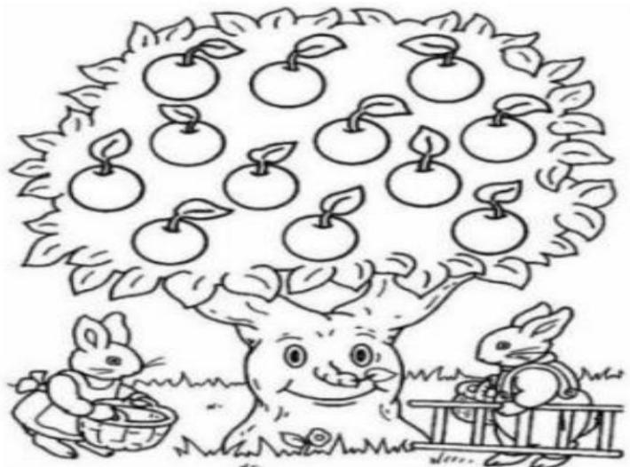

题目：观察图片，图片中是什么季节？都有谁？它们在干什么？请用几句话写下来吧。

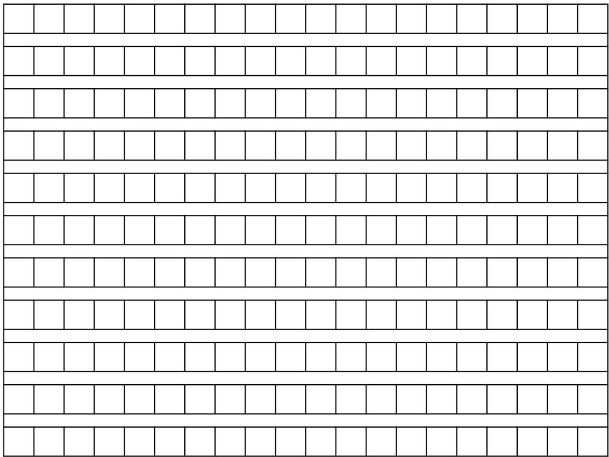

参考答案

# 一、拼音字母知识基础。（本大题共3小题，第1小题9分，第2小题10分，第3小题6分；本大题共25分）

1.根据题目按顺序填写字母。（本题共11小题，每空1分，共9分）

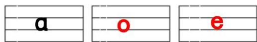

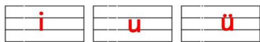

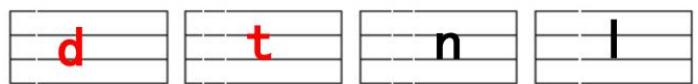

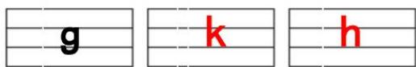

2.照样子，把字母改写成整体认读音节。（本题共5小题，每空2分，共10分）

例：c→ C i

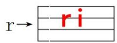

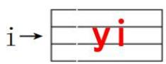

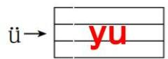

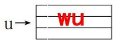

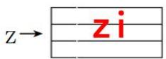

3. 按要求分一分。（本题共3小题，每小题2分，共6分）

①yu

(2)ying

③W

④ liang

⑤p

$⑥$ ri

⑦quan

⑧yun

$⑨$ ye

⑩wu

1.声母： ③⑤

2. 三拼音节：_____④⑦

3. 整体认读音节： ①②⑥⑧⑨⑩

# 二、拼音音节拼写与拼读。（本大题共3小题，第1小题8分，第2小题11分，第3小题10分；共29分）

1. 拼一拼，选一选，在正确的读音后面打“√”。（本题共4小题，共8分）

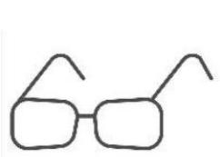

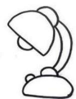

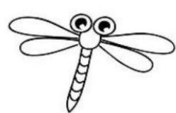

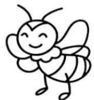

yanjin （ ）

tái dēn (   )

qing tin

mi fong ( )

yan jing (

tái dēng ( √ )

qing ting ( √ )

mi fēng ( √ )

2.读一读，填一填。（本题共9小题，每空1分，共11分）

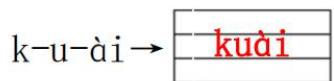

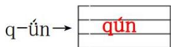

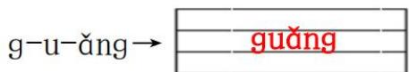

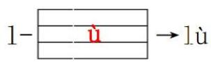

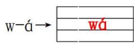

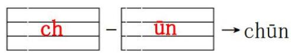

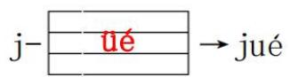

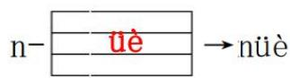

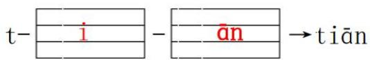

3. 读一读下列句子，用“____”画出错误的音节并改正。（本题每空1分，共10分）

（1）zì jǐ de sì qing zì jǐ zhuò.

（si）--（shi）

（ zhuò）--（ zuò）

(2) xiǎo wén hé dà da zài zhé zǐ.

（da）--（ba）

（da）--（ba）

（zǐ）--（zhi）

# 三、按要求完成题目。（本大题共3小题，第1小题8分，第2小题9分，第3小题8分；共25分）

1. 按要求变新字再组词。（本题共4小题，每小题2分，共8分）

加一笔：人→（大人）

口→ 日 日子

加两笔：人→（天上）

口→ 目 （目光）

2.圈一圈，填一填。（本题共2小题，共9分）

（1）从图中找到“山”“花朵”“云”，并用“◎”圈起来。（共3分）

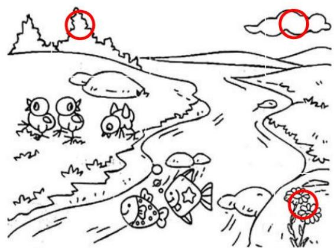

（2）选择合适的量词填空。（填序号）（共6分）

(1)只

②朵

(3)座

(4)条

一（ ）山

一（ ）花

一（ ）鸟

一（ ）鱼

一（ ）鸡

一（ ）云

3.口语交际，选择合适的词语填空。（本题共4小题，每小题2分，共8分）

①早上好 ②请 （1）有事请人帮忙，你要说：“ ② 。”  
① 谢谢 ② 对不起 （2）别人帮助里你，你要说：“ ① ”  
①来啦 ②早上好 (3)早上上学见到老师,你要说：“老师, ②。”  
①对不起 ②没关系 （4）你不小心弄坏同桌的铅笔，你要说：“ ① ”

# 四、阅读短文，回答问题。（本大题共4小题，第1小题2分，第2小题3分，第3小题3分，第4小题2分；本大题共10分）

chí páng gē

# 翅膀歌

yàn zǐ shì chūn tiān de chì páng qīng tíng shì xià tiān de chì páng

燕子是春天的翅膀。蜻蜓是夏天的翅膀。

dà yàn shì qū tiān de chí páng xuě hǔ shì dòng tiān de chí páng

大雁是秋天的翅膀。雪花是冬天的翅膀。

li xiǎng shì wǒ men de chì páng zhǎn chì xiàng wèi lái fēi xiáng

理想是我们的翅膀，展翅向未来飞翔。

1.这首儿歌共有（5）句话。（2分）  
2.这首儿歌中出现的小动物有哪些？用“O”圈出来。（3分）  
3. 儿歌中出现了哪几个季节？（①②③④）（多选题）（3分）

①春天

②夏天

(3)秋天

④冬天

4. 什么是“我们”的翅膀？请你用“ ”画出来。（2分）

# 五、看图写话。（本大题共1小题，请将答案书写在下方的答题纸上，注意书写要清洗，卷面要整洁；本大题共9分）

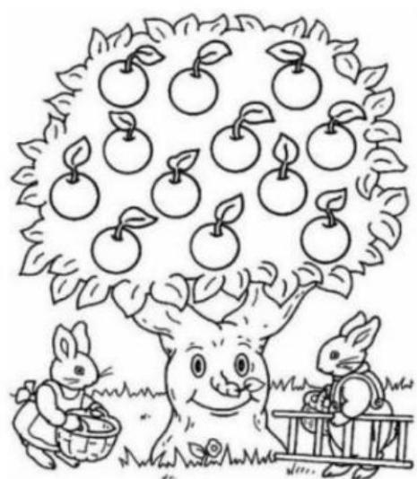

题目：观察图片，图片中是什么季节？都有谁？它们在干什么？请用几句话写下来吧。

评分标准：1. 句子通顺；2. 拼音书写正确；3. 无错别字；

4. 标点符号使用正确 5. 书写格式正确；6. 图画意思表达清晰。